# YAPA × DSH — Session Flow

How every default-visible `yapa_*` tool (23) and every automatic plugin hook
fits into a normal agent–human session inside the DeepSeek Harness. Source of
truth: `packages/dsh/src/{index,tools,tools-advanced,injector,lifecycle,
response-capture,compaction-capture,schedule-bridge,approval-gate}.ts`.

## The flow

```mermaid
flowchart LR
    subgraph START["① Session start (once per session)"]
        direction TB
        A1["Human sends first prompt"] --> A2["<b>agent/pre-step injector</b>:<br/>scope detection"]
        A2 --> A3["Injected <b># YAPA Context</b> block:<br/>• recalled memories<br/>• open tasks for the scope<br/>• compaction candidates"]
    end

    subgraph PROMPT["② Every subsequent prompt"]
        direction TB
        B1["Human prompt"] --> B2["<b>agent/pre-step injector</b>:<br/>auto recall on the new prompt<br/>(tasks not re-surfaced)"]
        B4["Auto-capture notice<br/>(if prior turn captured)"] -.-> B2
    end

    subgraph TURN["③ Agent's turn — tools the agent calls"]
        direction LR
        subgraph READ["Read / orient"]
            direction TB
            C1["yapa_memory_recall<br/><i>more specific query</i>"]
            C3["yapa_task_list /<br/>yapa_task_search"]
            C2["yapa_memory_list"]
            C4["yapa_collection_list"]
            C5["yapa_status<br/><i>after any storage error</i>"]
        end
        subgraph WRITE["Capture / commit"]
            direction TB
            C6["yapa_memory_store<br/><i>conflicts → supersede<br/>or coexist</i>"]
            C8["yapa_task_create"]
            C9["yapa_task_update<br/><i>status / blocked+reason</i>"]
            C10["yapa_task_complete<br/><i>regenerates if recurring</i>"]
            C12["yapa_task_add_dependency"]
            C13["yapa_journal_append<br/><i>one line per milestone</i>"]
            C7["yapa_memory_forget ⛨"]
            C11["yapa_task_delete ⛨"]
            C14["yapa_collection_create /<br/>yapa_collection_delete ⛨"]
        end
        READ ~~~ WRITE
    end

    subgraph TURNEND["④ Turn end (automatic)"]
        direction TB
        D1["<b>turn/end</b> event"] --> D2["Response-capture extractor<br/>(aux LLM)"]
        D2 --> D3["Resolver: skip /<br/>add / supersede"]
        D3 --> D4["Auto-stored memories<br/><i>auto-capture, salience ≤ 2.0</i>"]
    end

    subgraph END["⑥ Session end (automatic)"]
        direction TB
        F1["<b>session/disposed</b>"] --> F2["Journal drafts → one<br/>memory tagged <i>journal</i><br/><i>or yapa_journal_consolidate early</i>"]
    end

    subgraph BRIDGES["⑤ Bridges (tools/result observers)"]
        direction TB
        E1["task create/update<br/>+ future due date"] --> E2["<b>schedule_create</b><br/>reminder"]
        E3["<b>compaction/summary</b><br/>(context window)"] --> E4["Summary stored as<br/>episodic memory"]
    end

    subgraph BG["⑦ Background timers"]
        direction TB
        G1["Hourly decay sweep<br/><i>manual: yapa_decay_sweep</i>"]
        G2["Daily contradiction janitor<br/><i>manual: yapa_janitor_now</i>"]
        G3["Sync loop when enabled<br/><i>manual: yapa_sync</i>"]
    end

    subgraph MAINT["⑧ Occasional maintenance"]
        direction TB
        H1["Candidate flagged in ①"] --> H2["yapa_compaction_suggest"] --> H3["yapa_compaction_apply<br/><i>summary + members archived</i>"]
        H4["yapa_storage_import ⛨<br/><i>ChromaDB → local store</i>"]
    end

    START ==> TURN
    PROMPT ==> TURN
    TURN ==> TURNEND
    TURNEND ==> END
    TURN -.-> BRIDGES
    TURN -.-> MAINT
    D4 -.->|"notice on next prompt"| B4
    END ~~~ BG

    classDef gated fill:#fee,stroke:#c00
    class C7,C11,C14,H4 gated
```

⛨ = approval-gated (`tools/pre-execute` → `ask`) when the session policy is
`ask`; headless without an answerer fails closed. `yapa_storage_import` also
requires `confirm: true`.

## Tool-by-tool placement

| # | Tool | Phase | Who calls it | Trigger |
|---|------|-------|--------------|---------|
| 1 | `yapa_status` | ③ | agent | Any `yapa_*` tool fails with a storage error |
| 2 | `yapa_memory_store` | ③ | agent | Root cause found, decision/preference stated, config learned, non-obvious fact discovered (salience ≥ 2.0) |
| 3 | `yapa_memory_recall` | ③ | agent | Only for a *different/more specific* query — the prompt's recall is already auto-injected in ①/② |
| 4 | `yapa_memory_forget` ⛨ | ③ | agent | Memory should never have existed (prefer `supersedes` for corrections) |
| 5 | `yapa_memory_list` | ③ | agent | Browse with metadata filters instead of semantic search |
| 6 | `yapa_compaction_suggest` | ⑧ | agent | A "compaction candidate" collection was flagged in the injected context |
| 7 | `yapa_compaction_apply` | ⑧ | agent | After drafting a rolling summary for each suggested group |
| 8 | `yapa_journal_append` | ③ | agent | A meaningful step completes (decision, finding, task closed) |
| 9 | `yapa_journal_consolidate` | ⑥ | agent (optional) | Natural close before session end; otherwise runs automatically on `session/disposed` |
| 10 | `yapa_task_create` | ③ | agent | Before starting multi-step/long-lived work; follow-up identified; can't finish this turn |
| 11 | `yapa_task_list` | ③ | agent | Suspected drift; `id` param fetches full detail (notes, dependencies) |
| 12 | `yapa_task_update` | ③ | agent | Status change, `blocked` + reason, scope amendment, due-date change |
| 13 | `yapa_task_complete` | ③ | agent | Work done; recurring tasks regenerate automatically |
| 14 | `yapa_task_delete` ⛨ | ③ | agent | Permanent removal |
| 15 | `yapa_task_search` | ③ | agent | Semantic lookup across tasks |
| 16 | `yapa_task_add_dependency` | ③ | agent | depends-on / blocks relationship |
| 17 | `yapa_collection_list` | ③ | agent | Before creating a collection; scope sanity check |
| 18 | `yapa_collection_create` | ③ | agent | New scope needed — after confirming the name with the user |
| 19 | `yapa_collection_delete` ⛨ | ③ | agent | Deletes collection + all contents — confirm with user first |
| 20 | `yapa_decay_sweep` | ⑦ | agent (rare) | Manual salience decay; normally the hourly timer handles it |
| 21 | `yapa_janitor_now` | ⑦ | agent/user | Manual contradiction sweep; daily timer runs it otherwise |
| 22 | `yapa_sync` | ⑦ | agent/user | `status` / `now` / `collections` / `subscribe` / `unsubscribe` against the remote pgvector DB |
| 23 | `yapa_storage_import` ⛨ | ⑧ | user-driven | One-off ChromaDB → embedded-local migration (`confirm: true` required) |

## Automatic hooks that never appear as tool calls

| Hook (DSH event) | What it does | Surfacing |
|---|---|---|
| `agent/pre-step` (injector) | Scope detection, auto-recall per human prompt, open tasks once per scope per session, capture notices, compaction candidates | `# YAPA Context` plugin message spliced after the prompt |
| `session/event` → `user/message` + `assistant/message` + `turn/end` (response-capture) | Buffers the turn, aux-LLM extractor, resolver decides skip/add/supersede | Auto-stored memories; one-line notice on the next injection |
| `session/event` → `compaction/summary` (compaction-capture) | Stores the harness's context-compaction summary as an episodic memory | Recalled by future sessions |
| `tools/result` on task create/update (schedule-bridge) | Future due date → `schedule_create` reminder | `schedule_list` shows the bridged wake-up |
| `tools/pre-execute` (approval-gate) | `ask` verdict for gated tools under ask-policy | GUI approval prompt / fail-closed headless |
| `session/disposed` (lifecycle) | Consolidates the session's journal drafts into one `journal` memory | Recalled by future sessions |
| `ctx.interval` hourly (lifecycle) | Salience decay sweep when due | — |
| `ctx.interval` daily (lifecycle) | Contradiction janitor (bounded, conservative) | — |
| core `startSync` interval (lifecycle) | Push/pull against remote PostgreSQL+pgvector when enabled | — |
| `systemPrompt.section` order 50 (promoted-section) | Promoted memories pinned in the system prompt (cache refreshed on activate / 5 min / after bucket calls) | Always in system prompt |
| `systemPrompt.section` order 190 (rules) | Standing behavioral rules (replaces the CLAUDE.md install block) | Always in system prompt |

## Not shown (gated off by default)

The 18 ML-ops tools (`yapa_curation_*`, `yapa_bucket_*`,
`yapa_system_prompt_*`, `yapa_training_*`, `yapa_eval_*`, `yapa_adapter_*`)
register only when `trainingPipeline: true` (settings hot-reload re-registers
the group without a restart).
